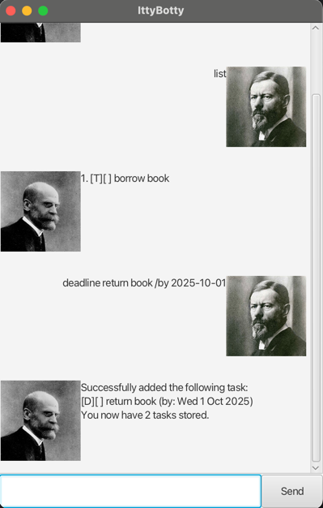

# IttyBotty User Guide

A chatbot that helps you keep track of your tasks!

## Adding ToDo

A ToDo is a task _without_ a deadline.

Command: `todo <description>`

- The `<description>` can be multiple words long, but should not contain
  any double quotation marks.

Example: `todo borrow book`

## Adding tasks with deadlines

Add a task with a deadline

Command: `deadline <description> /by <deadline>`

- The `<description>` can be multiple words long, but should not contain
  any double quotation marks.
- The `<deadline>` should be in the format `YYYY-MM-DD`. For example,
  `2025-01-01` is acceptable, but `25-1-1` or `2025/01/01` are not.

Example: `deadline return book /by 2025-10-25`

## Adding events

Add an event with a start and end date

Command: `event <description> /from <start date> /to <end date>`

- The `<description>` can be multiple words long, but should not contain
  any double quotation marks.
- The `<start date>` and `<end date>` should be in the format 
  `YYYY-MM-DD`. For example, `2025-01-01` is acceptable, but `25-1-1` 
  or `2025/01/01` are not.

Example: `event book giveaway /from 2025-11-20 /to 2025-11-27`

## Listing tasks

List all current tasks

Command: `list`

## Searching for tasks

Find tasks whose description includes the given search term.

Command: `find <search term>`

Example: `find book`

## Marking task as done

Command: `mark <task index>`

Use the `list` or `find` commands to find the task index.

You can undo marking a task as done using the command 
`unmark <task index>`.

## Image Credits

Image of user: "Max Weber, 1918", retrieved from 
[Wikimedia Commons](https://commons.wikimedia.org/wiki/File:Max_Weber,_1918.jpg),
by Ernst Gottmann, public domain, cropped and flipped.

Image of bot: "Émile Durkheim", retrieved from 
[Wikimedia Commons](https://commons.wikimedia.org/wiki/File:%C3%89mile_Durkheim.jpg),
by Unknown author, public domain, cropped and flipped.
